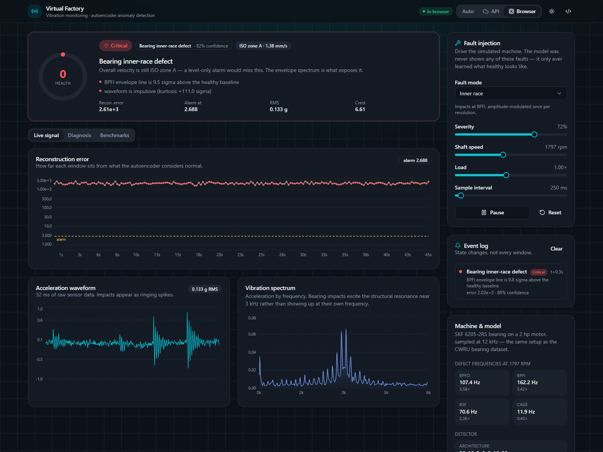
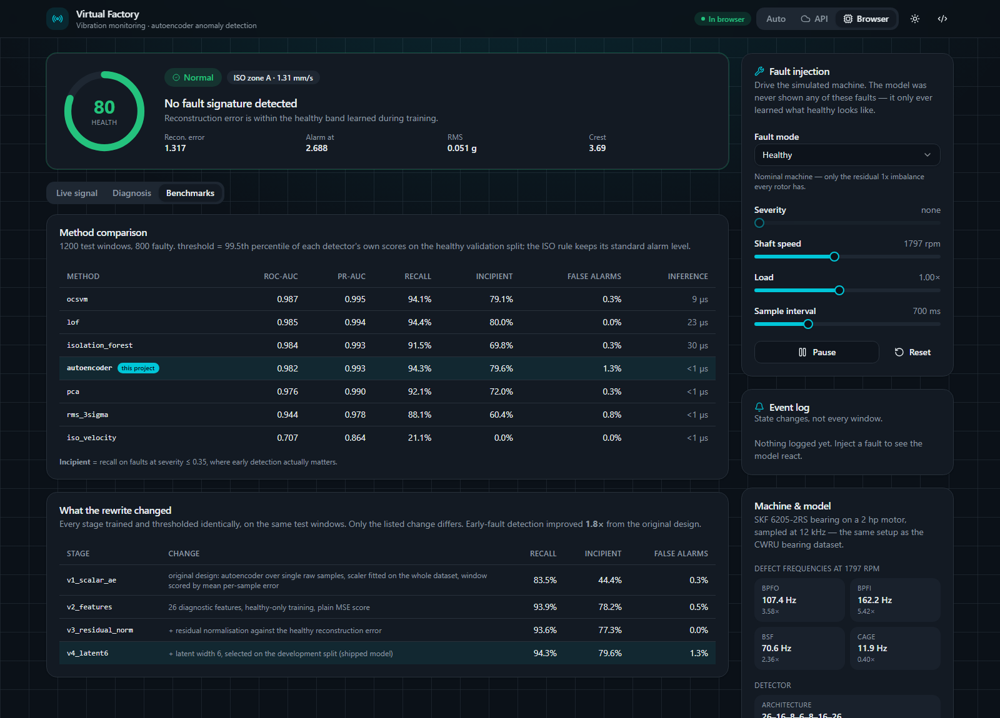
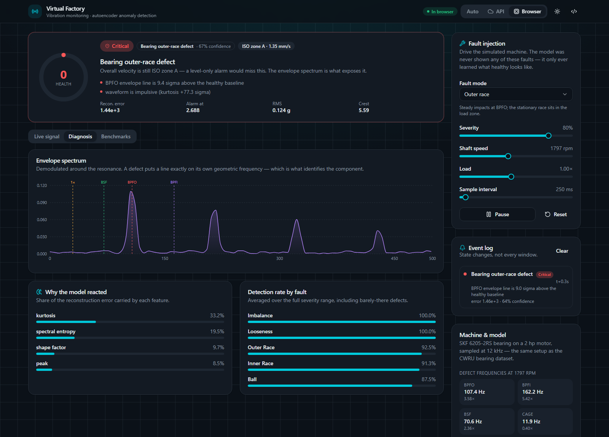

# 📡 Virtual Factory — Vibration Anomaly Detection

Condition monitoring for rotating machinery, end to end: a physics-based
vibration simulator, an autoencoder trained on healthy data only, an
envelope-spectrum diagnosis layer, and a live dashboard that runs with or
without a backend.



<sub>Live view: a 72 %-severity inner-race defect. The model flags it, the rule
layer names it, and the ISO velocity reading stays in zone A — which is exactly
why an overall-level alarm would have missed it.</sub>

## 🌍 Languages / Diller

- [🇬🇧 English](#-english)
- [🇹🇷 Türkçe](#-türkçe)

---

## 🇬🇧 English

### What it does

A simulated 2 hp motor on an SKF 6205 bearing streams accelerometer windows.
Each window is condensed into 26 diagnostic features, scored by a dense
autoencoder that has only ever seen a healthy machine, and — when the score
crosses the alarm threshold — explained by an explicit rule set that names the
faulty component.

You can inject six fault modes at any severity and watch the model react.
Nothing is pre-recorded.

| | |
| --- | --- |
| **Detection** | one-class autoencoder, 26 → 16 → 8 → **6** → 8 → 16 → 26, 1 264 parameters |
| **Diagnosis** | envelope-spectrum rules at BPFO / BPFI / BSF / cage frequencies |
| **Serving** | FastAPI + WebSocket, NumPy inference, no PyTorch in production |
| **Dashboard** | React 19 + Vite + Tailwind v4 + shadcn/ui, live or fully in-browser |
| **Tests** | 63 pytest cases, plus a TypeScript ↔ Python numerical parity check |

---

### Why it was rewritten

The first version of this project trained an autoencoder on a **single scalar
sample** of vibration, then never loaded the trained weights in the dashboard
at all — the live app scored every window with a randomly initialised network.
Its scaler was fitted on the whole dataset including the faults, and its
detection threshold was read off the ground-truth labels at inference time.
The "vibration" itself came from `np.random.normal`, a number with no
mechanical meaning, so no diagnostic feature could have worked on it.

Rather than assert that the rewrite is better, the repository measures it. Each
stage is trained and thresholded with the same policy, on the same test
windows; only the listed change differs:

| Stage | ROC-AUC | PR-AUC | Recall | Incipient recall | False alarms |
| --- | ---: | ---: | ---: | ---: | ---: |
| `v1_scalar_ae` — the original design | 0.963 | 0.985 | 0.835 | **0.444** | 0.003 |
| `v2_features` — 26 diagnostic features, healthy-only training | 0.984 | 0.994 | 0.939 | 0.782 | 0.005 |
| `v3_residual_norm` — residual normalisation | 0.983 | 0.993 | 0.936 | 0.773 | 0.000 |
| `v4_latent6` — latent width from the dev split *(shipped)* | 0.982 | 0.993 | **0.943** | **0.796** | 0.013 |

**Incipient recall** — detection of faults at severity ≤ 0.35 — rises from
44 % to 80 %. That is the number that matters: catching a defect while it is
still cheap to fix is the entire purpose of condition monitoring. Overall
ROC-AUC barely moves, which is exactly why headline AUC is a poor way to judge
this problem.

Regenerate with `python scripts/train_and_benchmark.py`.



<sub>Both tables ship inside the product, not just this README — including the
row where the autoencoder loses.</sub>

---

### How it compares to equivalent detectors

Every learned method below is trained on the same healthy-only feature matrix
and has its operating point fixed by the same policy — the 99.5th percentile of
its own scores on a healthy validation split it never trained on. Without that
discipline a benchmark mostly measures whose threshold was tuned hardest.

| Method | ROC-AUC | PR-AUC | Recall | Incipient | False alarms | Inference |
| --- | ---: | ---: | ---: | ---: | ---: | ---: |
| `ocsvm` | **0.987** | **0.995** | 0.941 | 0.791 | 0.003 | 9 µs |
| `lof` | 0.985 | 0.994 | **0.944** | **0.800** | 0.000 | 23 µs |
| `isolation_forest` | 0.984 | 0.993 | 0.915 | 0.698 | 0.003 | 30 µs |
| **`autoencoder`** *(this project)* | 0.982 | 0.993 | 0.943 | 0.796 | 0.013 | **< 1 µs** |
| `pca` | 0.976 | 0.990 | 0.921 | 0.720 | 0.003 | < 1 µs |
| `rms_3sigma` | 0.944 | 0.978 | 0.881 | 0.604 | 0.007 | < 1 µs |
| `iso_velocity` | 0.707 | 0.864 | 0.211 | 0.000 | 0.000 | — |

Read honestly, that table says three things:

1. **The autoencoder does not beat the classical novelty detectors.** One-class
   SVM and LOF edge it out on ranking quality. On a 26-feature tabular problem
   with 1 200 training rows, that is the expected result, and claiming
   otherwise would require a benchmark designed to flatter the neural network.
2. **It earns its place on deployment cost, not accuracy.** Scoring is a
   1 264-parameter matrix multiply — 20-30× faster than LOF or an isolation
   forest, and the whole model serialises to a 39 KB JSON file that runs
   unchanged in Python *and* in the browser. A fitted `IsolationForest` is a
   pickle that only `scikit-learn` of the right version can open, and pickles
   execute arbitrary code on load. The autoencoder also attributes its error
   per feature, which is what drives the "why the model reacted" panel.
3. **The industry-standard overall-level rule is nearly blind here.** ISO
   20816-3 measures RMS velocity over 10-1000 Hz, and a bearing defect puts its
   energy in a structural resonance near 3 kHz — so a severe outer-race spall
   still reads as zone A. `iso_velocity` catches the imbalance and looseness
   cases and misses essentially every bearing fault. That is not a strawman;
   it is what a large share of deployed monitoring actually does, and it is the
   reason envelope analysis exists.

Detection rate per fault mode for the shipped model, across the full severity
range including barely-there defects: imbalance 100 %, looseness 100 %,
outer race 92.5 %, inner race 91.2 %, rolling element 87.5 %.



<sub>The envelope spectrum for an outer-race defect: a sharp line exactly on
BPFO plus its harmonics, while the BPFI and BSF markers stay on the noise
floor. That separation is what lets the rule layer name the component instead
of only reporting "something is wrong".</sub>

#### Against comparable open-source projects

Most public "vibration anomaly detection" repositories stop at one of three
places: a notebook that reports accuracy on a balanced split (which hides the
class imbalance that makes the problem hard), a Streamlit demo with no
benchmark, or a `scikit-learn` novelty detector with no domain features. This
project differs on four specific points:

- **Signals with mechanical meaning.** Impacts are generated as an impulse
  train at the geometric defect frequency, each ringing down a structural
  resonance, with load-zone modulation and rolling-element slip — so envelope
  analysis works for the same reason it works on real machines. Severity is
  calibrated against ISO 20816-3 velocity zones rather than being an arbitrary
  multiplier.
- **No label leakage anywhere.** Scaler and residual statistics come from the
  training split, the threshold from a healthy validation split, model
  selection from a separate development split, and labels are used only in the
  final evaluation.
- **A comparison that can lose.** The baselines are real, tuned by a shared
  policy, and the result is reported even though the autoencoder does not win.
- **The demo is the artifact.** The published dashboard runs the actual model,
  not a recording — in the browser, with no backend.

---

### Escaping Streamlit

The original dashboard was a `for` loop with `time.sleep(0.5)` in the script
body. Streamlit re-runs the whole script on every interaction, so that loop
blocked the session, could not be paused, kept no state between runs, redrew a
Matplotlib figure per frame, and served exactly one viewer per process. None of
that is a Streamlit bug — it is what happens when a streaming problem is forced
into a re-run-the-script framework.

The replacement splits the concerns:

```
                   ┌──────────────────────────────────────────┐
 simulator ──▶ features ──▶ autoencoder ──▶ verdict + evidence │  vfactory (Python)
                   └──────────────────┬───────────────────────┘
                                      │ FastAPI  /api/stream (WebSocket)
                                      ▼
                   ┌──────────────────────────────────────────┐
                   │  React + Tailwind + shadcn/ui dashboard   │
                   └──────────────────┬───────────────────────┘
                                      │ no API reachable?
                                      ▼
                   ┌──────────────────────────────────────────┐
 simulator ──▶ features ──▶ autoencoder ──▶ verdict + evidence │  TypeScript port
                   └──────────────────────────────────────────┘
```

Both paths emit an identical frame, so the UI never knows which one is running.
The TypeScript port is not decorative: it is the reason the published site
works on GitHub Pages with no server, no cold start and no hosting bill. A
parity check asserts the two implementations agree to ~1e-14 on a frozen
fixture, and it runs in CI — because two implementations of the same DSP drift
silently, and the failure mode is a dashboard that keeps rendering while
quietly showing different numbers.

#### Deployment options

| Target | Command | Notes |
| --- | --- | --- |
| Single container (API + UI) | `docker build -t vfactory . && docker run -p 8000:8000 vfactory` | One origin, no CORS. Runtime image installs FastAPI + NumPy only |
| Render | `render.yaml` blueprint | Free tier; cold-starts in ~1 s because there is no PyTorch to load |
| GitHub Pages / Cloudflare Pages | `BASE_PATH=/python-data-projects/ npm run build` | Static, browser-side inference, no backend at all |
| Separate API + CDN frontend | set `VITE_API_BASE` and `VFACTORY_ALLOWED_ORIGINS` | CORS allowlist, rate limit and stream cap are all env-configurable |

---

### Running it

```bash
cd SyntheticData+AI

# 1. Train the model and generate the benchmark + ablation artifacts.
pip install -r requirements-train.txt
python scripts/train_and_benchmark.py

# 2. Serve the API.
pip install -r requirements.txt
uvicorn vfactory.api.main:app --app-dir src --reload

# 3. Run the dashboard (proxies /api to the service above).
cd frontend && npm install && npm run dev
```

The dashboard also works with no API running — it falls back to the in-browser
engine and says so.

```bash
# Tests, lint, and the TypeScript/Python parity check.
pip install -r requirements-dev.txt
python -m pytest -q
python -m ruff check src tests scripts
cd frontend && npm run check:parity
```

---

### Security

The service is a public, read-only demo, and it is built to survive being one.

- **No secrets, no credentials, no accounts.** Nothing in the repository reads
  an API key, and the service calls no third-party endpoint — it has no network
  egress at all. There is nothing here to steal or to bill.
- **No pickles.** The model artifact is plain JSON. `torch.load` on an
  untrusted `.pth` executes arbitrary code; the loader here rejects any bundle
  whose schema version it does not recognise and never deserialises objects.
- **Origin allowlist that covers WebSockets too.** CORS middleware never sees a
  WebSocket handshake, and browsers do not apply the same-origin policy to
  WebSockets — so the stream route checks `Origin` itself. The default
  allowlist is localhost only; a deployment that forgets to configure it fails
  closed rather than opening to `*`.
- **Bounded work per caller.** 120 requests/minute per address, 2 MB request
  bodies, 24 000 samples per analysis, 16-32 concurrent streams, 240 control
  messages/minute per socket. Every numeric field is range-checked by schema.
- **Errors that do not echo.** A rejected request is answered with the reason
  only — never the payload, which would otherwise turn a 24 000-element array
  into a free amplification vector.
- **Strict headers.** `nosniff`, `DENY` framing, no referrer, and a CSP of
  `default-src 'none'` on the JSON routes; the bundled dashboard gets
  `default-src 'self'` with no CDN, no inline script and no third-party origin.
- **Runs unprivileged.** The container runs as a non-root user and writes
  nothing outside its own memory.

Dependencies are audited in CI (`npm audit` reports 0 vulnerabilities at the
time of writing) and the runtime image installs four packages.

---

### Deep links

The dashboard reads its starting state from the query string, so a finding is
shareable as a URL and a headless browser can capture a meaningful screenshot:

```
?mode=inner_race&severity=0.72&rpm=1797&load=1&interval=250&tab=diagnosis&engine=offline
```

Every value is clamped to the same range the API enforces.

---

### Layout

```
SyntheticData+AI/
├── src/vfactory/
│   ├── config.py         # bearing geometry, acquisition, ISO 20816 zones
│   ├── simulator.py      # impulse trains, resonance ringdown, load modulation
│   ├── features.py       # 26 time / spectral / envelope features
│   ├── dataset.py        # leak-free train / validation / dev / test splits
│   ├── train.py          # PyTorch training → portable JSON weights
│   ├── autoencoder.py    # NumPy inference runtime + bundle format
│   ├── detector.py       # verdict, error attribution, diagnosis rules
│   ├── baselines.py      # OCSVM, LOF, isolation forest, PCA, RMS, ISO rule
│   ├── benchmark.py      # the comparison
│   ├── ablation.py       # what each rewrite step bought
│   └── api/              # FastAPI app, schemas, transport hardening
├── frontend/src/lib/offline/   # the TypeScript port (FFT, features, model)
├── artifacts/            # model.json, benchmark.json, ablation.json
├── scripts/              # train_and_benchmark.py, make_parity_fixture.py
└── tests/                # 63 cases
```

---

### Notes and limits

- **All data is synthetic.** No real machine was measured. The signal model is
  physically motivated and the bearing frequencies match published SKF 6205
  values, but results on real accelerometer data would differ — real machines
  bring speed variation, multiple simultaneous faults, sensor mounting effects
  and non-stationary load that this simulator does not reproduce.
- **The diagnosis layer is rules, not a classifier.** The model decides
  *whether* something is wrong; the rules explain *what*, and every rule that
  fired is shown so the verdict can be argued with. It cannot name a fault it
  has no rule for, and says "unclassified anomaly" instead of guessing.
- **The threshold is a false-alarm budget, not a truth.** At the 99.5th
  percentile it accepts roughly one false alarm per 200 windows. Tightening it
  trades recall for quiet; the benchmark reports both sides.

---

## 🇹🇷 Türkçe

### Ne yapıyor

SKF 6205 rulmanlı, simüle edilmiş 2 hp'lik bir motor ivmeölçer pencereleri
üretiyor. Her pencere 26 tanı özniteliğine indirgeniyor, yalnızca **sağlıklı**
makine görmüş bir otokodlayıcı tarafından puanlanıyor ve puan alarm eşiğini
aştığında, arızalı bileşeni adıyla söyleyen açık bir kural kümesiyle
açıklanıyor.

Altı arıza modunu istediğiniz şiddette enjekte edip modelin tepkisini
izleyebilirsiniz. Hiçbir şey önceden kaydedilmiş değil.

| | |
| --- | --- |
| **Tespit** | tek sınıflı otokodlayıcı, 26 → 16 → 8 → **6** → 8 → 16 → 26, 1 264 parametre |
| **Teşhis** | BPFO / BPFI / BSF / kafes frekanslarında zarf spektrumu kuralları |
| **Sunum** | FastAPI + WebSocket, NumPy çıkarım, üretimde PyTorch yok |
| **Arayüz** | React 19 + Vite + Tailwind v4 + shadcn/ui, canlı ya da tamamen tarayıcıda |
| **Test** | 63 pytest, ayrıca TypeScript ↔ Python sayısal parite kontrolü |

---

### Neden baştan yazıldı

Projenin ilk hâli otokodlayıcıyı **tek bir skaler örnek** üzerinde eğitiyordu ve
eğitilmiş ağırlıkları arayüzde hiç yüklemiyordu — canlı uygulama her pencereyi
rastgele başlatılmış bir ağla puanlıyordu. Ölçekleyici arızalar dâhil tüm veri
üzerinde uyduruluyor, eşik ise çıkarım anında gerçek etiketlerden okunuyordu.
"Titreşim" verisi `np.random.normal`'dan geliyordu; mekanik anlamı olmayan bir
sayı olduğu için üzerinde hiçbir tanı özniteliği çalışamazdı.

Yeniden yazımın daha iyi olduğunu iddia etmek yerine, depo bunu ölçüyor. Her
aşama aynı politikayla eğitilip eşikleniyor ve **aynı test pencerelerinde**
değerlendiriliyor; yalnızca belirtilen değişiklik farklı:

| Aşama | ROC-AUC | PR-AUC | Yakalama | Erken evre | Yanlış alarm |
| --- | ---: | ---: | ---: | ---: | ---: |
| `v1_scalar_ae` — orijinal tasarım | 0.963 | 0.985 | 0.835 | **0.444** | 0.003 |
| `v2_features` — 26 öznitelik, sağlıklı-veriyle eğitim | 0.984 | 0.994 | 0.939 | 0.782 | 0.005 |
| `v3_residual_norm` — artık normalizasyonu | 0.983 | 0.993 | 0.936 | 0.773 | 0.000 |
| `v4_latent6` — dev kümesinden gizli katman *(yayınlanan)* | 0.982 | 0.993 | **0.943** | **0.796** | 0.013 |

**Erken evre yakalama** (şiddet ≤ 0.35) %44'ten %80'e çıkıyor. Asıl önemli olan
sayı bu: bir kusuru hâlâ ucuza onarılabilirken yakalamak, durum izlemenin tüm
amacı. Genel ROC-AUC neredeyse hiç kıpırdamıyor — bu da tam olarak, bu problemi
manşet AUC ile değerlendirmenin neden yanıltıcı olduğunu gösteriyor.

Yeniden üretmek için: `python scripts/train_and_benchmark.py`.

---

### Muadil yöntemlerle karşılaştırma

Aşağıdaki öğrenen yöntemlerin hepsi aynı sağlıklı-veri matrisiyle eğitiliyor ve
çalışma noktası aynı politikayla belirleniyor: hiç eğitilmediği sağlıklı
doğrulama kümesindeki kendi puanlarının 99.5'inci yüzdeliği. Bu disiplin
olmadan bir kıyaslama çoğunlukla "kimin eşiği daha çok elle ayarlanmış" sorusunu
ölçer.

| Yöntem | ROC-AUC | PR-AUC | Yakalama | Erken evre | Yanlış alarm | Çıkarım |
| --- | ---: | ---: | ---: | ---: | ---: | ---: |
| `ocsvm` | **0.987** | **0.995** | 0.941 | 0.791 | 0.003 | 9 µs |
| `lof` | 0.985 | 0.994 | **0.944** | **0.800** | 0.000 | 23 µs |
| `isolation_forest` | 0.984 | 0.993 | 0.915 | 0.698 | 0.003 | 30 µs |
| **`autoencoder`** *(bu proje)* | 0.982 | 0.993 | 0.943 | 0.796 | 0.013 | **< 1 µs** |
| `pca` | 0.976 | 0.990 | 0.921 | 0.720 | 0.003 | < 1 µs |
| `rms_3sigma` | 0.944 | 0.978 | 0.881 | 0.604 | 0.007 | < 1 µs |
| `iso_velocity` | 0.707 | 0.864 | 0.211 | 0.000 | 0.000 | — |

Bu tablo dürüstçe okunduğunda üç şey söylüyor:

1. **Otokodlayıcı klasik yöntemleri geçmiyor.** Tek sınıflı SVM ve LOF sıralama
   kalitesinde önde. 1 200 satırlık, 26 öznitelikli tablo tipi bir problemde
   beklenen sonuç bu; aksini iddia etmek, sinir ağını kayıracak şekilde
   tasarlanmış bir kıyaslama gerektirirdi.
2. **Yerini doğruluğuyla değil, dağıtım maliyetiyle hak ediyor.** Puanlama 1 264
   parametrelik bir matris çarpımı — LOF veya isolation forest'tan 20-30 kat
   hızlı — ve tüm model 39 KB'lık bir JSON dosyasına serileşip hem Python'da hem
   tarayıcıda aynen çalışıyor. Eğitilmiş bir `IsolationForest` ise ancak doğru
   sürüm `scikit-learn` ile açılabilen bir pickle'dır ve pickle yüklerken
   rastgele kod çalıştırır. Otokodlayıcı ayrıca hatasını öznitelik bazında
   dağıtabiliyor; arayüzdeki "model neden tepki verdi" paneli buradan geliyor.
3. **Sektörün standart genel-seviye kuralı burada neredeyse kör.** ISO 20816-3,
   10-1000 Hz bandındaki RMS hızı ölçer; rulman kusuru ise enerjisini 3 kHz
   civarındaki yapısal rezonansa koyar — dolayısıyla ağır bir dış bilezik
   kusuru bile A bölgesinde okunur. `iso_velocity` balanssızlık ve gevşekliği
   yakalıyor, rulman arızalarının neredeyse tamamını kaçırıyor. Bu bir korkuluk
   değil; sahadaki izleme sistemlerinin önemli bir kısmının yaptığı tam olarak
   bu, ve zarf analizinin var olma sebebi de bu.

Yayınlanan modelin arıza tipine göre yakalama oranı (en hafif kusurlar dâhil,
tüm şiddet aralığında): balanssızlık %100, gevşeklik %100, dış bilezik %92.5,
iç bilezik %91.2, bilya %87.5.

---

### Streamlit lanetinden kurtulmak

Orijinal arayüz, betiğin gövdesinde `time.sleep(0.5)` içeren bir `for`
döngüsüydü. Streamlit her etkileşimde tüm betiği baştan çalıştırdığı için o
döngü oturumu kilitliyor, duraklatılamıyor, çalıştırmalar arasında durum
tutmuyor, kare başına bir Matplotlib figürü yeniden çiziyor ve süreç başına tam
olarak bir izleyiciye hizmet ediyordu. Bunların hiçbiri Streamlit hatası değil —
akış problemini "betiği baştan çalıştır" çerçevesine sokmanın doğal sonucu.

Yerine gelen mimari sorumlulukları ayırıyor: **API** simülasyonu ve çıkarımı
üstlenip analiz edilmiş kareleri WebSocket üzerinden gönderiyor; **arayüz** bu
kareleri çiziyor. API'ye ulaşılamadığında aynı hesabı tarayıcıda TypeScript
portu yapıyor. İkisi de birebir aynı kareyi üretiyor, arayüz hangisinin
çalıştığını bilmiyor.

Bu port dekoratif değil: yayınlanan sitenin GitHub Pages üzerinde sunucusuz,
soğuk başlangıçsız ve barındırma maliyetsiz çalışmasının sebebi. Bir parite
kontrolü iki uygulamanın dondurulmuş bir fikstürde ~1e-14 hassasiyetle
uyuştuğunu doğruluyor ve CI'da çalışıyor — çünkü aynı sinyal işlemenin iki
uygulaması sessizce birbirinden ayrışır ve arıza şekli, çizmeye devam ederken
sessizce farklı sayılar gösteren bir arayüzdür.

#### Canlıya alma seçenekleri

| Hedef | Komut | Not |
| --- | --- | --- |
| Tek konteyner (API + arayüz) | `docker build -t vfactory . && docker run -p 8000:8000 vfactory` | Tek origin, CORS yok. Çalışma imajı sadece FastAPI + NumPy kurar |
| Render | `render.yaml` blueprint | Ücretsiz katman; PyTorch yüklenmediği için ~1 sn'de uyanır |
| GitHub Pages / Cloudflare Pages | `BASE_PATH=/python-data-projects/ npm run build` | Statik, tarayıcıda çıkarım, backend gerekmiyor |
| Ayrı API + CDN arayüz | `VITE_API_BASE` ve `VFACTORY_ALLOWED_ORIGINS` | CORS listesi, hız limiti ve akış üst sınırı ortam değişkeniyle ayarlanır |

---

### Çalıştırma

```bash
cd SyntheticData+AI

# 1. Modeli eğit, kıyaslama ve ablasyon çıktılarını üret.
pip install -r requirements-train.txt
python scripts/train_and_benchmark.py

# 2. API'yi ayağa kaldır.
pip install -r requirements.txt
uvicorn vfactory.api.main:app --app-dir src --reload

# 3. Arayüzü çalıştır (/api isteklerini yukarıdaki servise yönlendirir).
cd frontend && npm install && npm run dev
```

API çalışmasa da arayüz çalışır — tarayıcı içi motora düşer ve bunu açıkça
belirtir.

---

### Güvenlik

Servis herkese açık, salt-okunur bir demo; öyle olmanın gereklerine göre
yazıldı.

- **Sır yok, kimlik bilgisi yok, hesap yok.** Depoda hiçbir yer API anahtarı
  okumuyor ve servis hiçbir üçüncü taraf uca istek atmıyor — dışarı hiç trafik
  çıkmıyor. Çalınacak ya da faturalandırılacak bir şey yok.
- **Pickle yok.** Model dosyası düz JSON. Güvenilmeyen bir `.pth` üzerinde
  `torch.load` rastgele kod çalıştırır; buradaki yükleyici tanımadığı şema
  sürümünü reddediyor ve hiçbir nesneyi deserialize etmiyor.
- **WebSocket'i de kapsayan origin listesi.** CORS ara katmanı WebSocket
  el sıkışmasını hiç görmez ve tarayıcılar WebSocket'e aynı-köken politikası
  uygulamaz — bu yüzden akış uç noktası `Origin` kontrolünü kendisi yapıyor.
  Varsayılan liste yalnızca localhost; yapılandırmayı unutan bir dağıtım `*`'a
  açılmak yerine kapalı kalıyor.
- **Çağrı başına sınırlı iş.** Adres başına dakikada 120 istek, 2 MB gövde,
  analiz başına 24 000 örnek, eşzamanlı 16-32 akış, soket başına dakikada 240
  kontrol mesajı. Her sayısal alan şema düzeyinde aralık denetiminden geçiyor.
- **Girdiyi geri yansıtmayan hatalar.** Reddedilen istek yalnızca gerekçeyle
  yanıtlanıyor; gövde asla geri dönmüyor — yoksa 24 000 elemanlı bir dizi
  bedava bir yükseltme aracına dönüşürdü.
- **Sıkı başlıklar.** `nosniff`, `DENY` çerçeveleme, referrer yok ve JSON
  uçlarında `default-src 'none'` CSP; paketlenmiş arayüz ise CDN'siz,
  satır-içi betiksiz, üçüncü taraf kökensiz `default-src 'self'` alıyor.
- **Yetkisiz çalışıyor.** Konteyner root olmayan bir kullanıcıyla çalışıyor ve
  kendi belleği dışına hiçbir şey yazmıyor.

Bağımlılıklar CI'da denetleniyor (`npm audit` bu yazının yazıldığı anda 0 zafiyet
raporluyor) ve çalışma imajı yalnızca dört paket kuruyor.

---

### Notlar ve sınırlar

- **Tüm veri sentetik.** Gerçek bir makine ölçülmedi. Sinyal modeli fiziksel
  olarak gerekçeli ve rulman frekansları yayımlanmış SKF 6205 değerleriyle
  birebir uyuşuyor; ancak gerçek ivmeölçer verisinde sonuçlar farklı olurdu —
  gerçek makinelerde hız değişimi, aynı anda birden fazla arıza, sensör montaj
  etkileri ve bu simülatörün üretmediği durağan olmayan yük vardır.
- **Teşhis katmanı kural tabanlı, sınıflandırıcı değil.** Model *bir şey var mı*
  sorusunu, kurallar *ne olduğunu* yanıtlıyor; tetiklenen her kural gösteriliyor
  ki karara itiraz edilebilsin. Kuralı olmayan bir arızayı adlandıramaz, tahmin
  yürütmek yerine "sınıflandırılamayan anomali" der.
- **Eşik bir gerçek değil, yanlış alarm bütçesidir.** 99.5'inci yüzdelikte kabaca
  200 pencerede bir yanlış alarm kabul eder. Sıkılaştırmak sessizliği yakalama
  oranıyla takas eder; kıyaslama her iki tarafı da raporlar.

---

### 📄 License

MIT

---

<div align="center">
<sub>📂 <a href="../README.md">Python Data Projects</a> koleksiyonunun bir parçasıdır.</sub>
</div>
