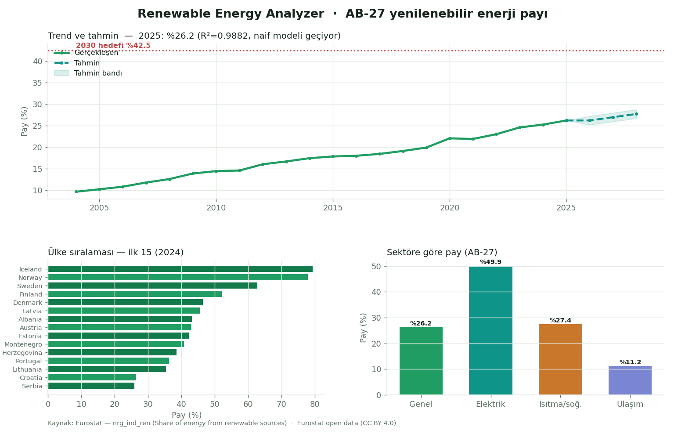

# 🌿 Renewable Energy Analyzer

Avrupa'da yenilenebilir enerjinin payını **gerçek Eurostat verisiyle** analiz eden,
uçtan uca yeniden inşa edilmiş bir veri projesi: güvenli veri hattı → sıkılaştırılmış
API → estetik, sade bir dashboard.

A rebuilt, end-to-end data project analysing the share of renewable energy in Europe
from **real Eurostat data**: a secure pipeline → a hardened API → a clean dashboard.

[](https://github.com/ErenAksu17/python-data-projects/actions/workflows/ci.yml)


🌍 **Canlı demo / Live demo →** https://claude.ai/code/artifact/4487d571-f1fd-4518-b94a-4050f5d0c9be

> **Diller / Languages:** [🇹🇷 Türkçe](#-türkçe) · [🇬🇧 English](#-english)



> Yukarıdaki görsel statik bir önizlemedir; gerçek dashboard interaktiftir (trend/tahmin,
> ülke keşfi, sektör kırılımı). Çalıştırmak için aşağıdaki adımları izleyin.

---

## 🔑 Öne çıkan bulgular / Key findings

- **AB-27, 2023'te %24.6** yenilenebilir paya ulaştı; **2025 (geçici) %26.2**. Bağlayıcı
  **2030 hedefi %42.5** — yani ~16 puan yol var.
- Doğrusal trend hızı **yılda +0.76 puan**; bu hızla hedef 2030'da **kaçırılıyor**. Bu,
  gerçek ve doğrulanmış (naif modeli geçen, R²≈0.99) bir tahmindir — sahte bir "×1.05" değil.
- **İmza içgörü:** Norveç (%122), Arnavutluk (%105) ve İzlanda (%102) gibi ülkelerde
  **elektrik** payı %100'ü aşar. Bu bir veri hatası değildir: yenilenebilir elektrik
  *üretimi* ÷ yurtiçi *tüketim*; hidro ağırlıklı net ihracatçılarda oran 100'ü geçebilir.
  Genel (overall) pay ise her zaman ≤ %100'dür — bu yüzden sektörleri ayırmadan ortalama almak yanlıştır.

---

## 🇹🇷 Türkçe

### Mimari

Tek bir not defteri yerine, sorumlulukları ayrılmış katmanlı bir mimari:

```
renewable-energy-analyzing/
├── data/
│   ├── raw/            # Eurostat'tan indirilen ham CSV (repoya dahil → offline çalışır)
│   └── processed/      # pipeline çıktısı JSON (yeniden üretilebilir)
├── src/renewable/      # veri hattı (importable paket)
│   ├── config.py       # tek doğruluk kaynağı: yollar, sabitler, ağ limitleri (sıfır sır)
│   ├── fetch.py        # GÜVENLİ indirme (HTTPS, host allow-list, timeout, boyut sınırı)
│   ├── clean.py        # ham → tidy long-format
│   ├── validate.py     # ingest anında fail-loud doğrulama
│   ├── analyze.py      # metrikler: CAGR, hedefe uzaklık, sektör, RES-E>%100 içgörüsü
│   ├── forecast.py     # DÜRÜST tahmin: doğrusal trend + walk-forward + naif baseline
│   └── pipeline.py     # fetch → clean → validate → analyze → JSON
├── api/
│   ├── main.py         # FastAPI: doğrulanmış endpoint'ler, güvenli statik servis
│   └── security.py     # güvenlik header'ları (CSP…) + IP başına rate-limit
├── frontend/           # React + Vite + Tailwind v4 + shadcn/ui + Recharts arayüz
│   └── src/            # bileşenler, tema, veri katmanı (window.__DATA__ ↔ /api)
├── tests/              # 21 test: pipeline, validasyon, tahmin, API güvenliği
└── scripts/
    ├── build_data.py       # veri hattı
    ├── build_standalone.py # tek dosyalık çevrimdışı/artifact sürümü
    └── make_preview.py     # README önizleme görseli
```

**Arayüz:** shadcn/ui bileşenleri (Card, Badge, Select, Progress) + Recharts
grafikleri, canlı bir renk paleti ve açık/koyu tema. Sunucu için harici-varlıklı
build (CSP-temiz); çevrimdışı/artifact için tek-dosya build (`window.__DATA__`
gömülü). FastAPI aynı arayüzü servis eder ve `/api/dataset` ile besler.

### 🔐 Güvenlik (özellikle API)

Bu proje güvenliği sonradan eklenen değil, tasarımdan gelen bir özellik olarak ele alır:

**Dış veri çekimi (outbound):**
- **HTTPS zorunlu** ve **host allow-list** (`ec.europa.eu`) → SSRF ve downgrade koruması.
- Redirect'ler kapalı, **timeout** ve **8 MB indirme sınırı** → asılı kalma/bellek taşması yok.
- Yanıt, yazılmadan önce **şema doğrulaması**ndan geçer; hatalı içerik iyi veriyi ezmez (atomik yazma).

**API (inbound):**
- **Girdi allow-list + Pydantic doğrulama:** ülke kodu bilinen listeyle sınırlı, bilinmeyen → jenerik 404 (girdi yansıtılmaz); sayısal parametreler sınırlı (`limit` 1–50).
- **Sıkı güvenlik header'ları** her yanıtta: `Content-Security-Policy`, `X-Frame-Options: DENY`, `X-Content-Type-Options: nosniff`, `Referrer-Policy`, `Permissions-Policy`, HSTS.
- **CORS** yalnızca localhost'a kilitli (`*` değil).
- **IP başına rate-limit** (`/api/*`), bellek-içi, bağımlılıksız.
- **Path traversal** korumalı statik servis; **sızıntısız hata yönetimi** (stack trace yok).
- **Sıfır sır:** anahtar gerekmez; ayarlar `.env` üzerinden (`.env` git-ignore'da).

CSP not: `script-src 'self'` (satır-içi script yok — asıl XSS koruması; bu yüzden
sunucu, tek-dosya değil **harici-varlıklı** React build'ini servis eder). `style-src`
yalnızca `'unsafe-inline'` içerir (Recharts satır-içi stil enjekte eder); bu bilinçli
ve kabul gören bir tavizdir.

### ▶️ Kurulum ve çalıştırma

```bash
# 1) Bağımlılıklar
pip install -r requirements.txt

# 2) Veriyi hazırla (önbellekteki ham CSV'yi kullanır; --refresh ile Eurostat'tan yeniler)
python scripts/build_data.py

# 3) Arayüzü derle (React + Vite + Tailwind + shadcn/ui)
cd frontend && npm install && npm run build && cd ..
#   (çevrimdışı/artifact için: npm run build:standalone && python scripts/build_standalone.py)

# 4) API + dashboard'u başlat
python -m uvicorn api.main:app --host 127.0.0.1 --port 8000
# Tarayıcıda aç: http://127.0.0.1:8000

# 5) Testler (geliştirme bağımlılıklarıyla)
pip install -r requirements-dev.txt
python -m pytest -q
```

### 📈 Veri ve yöntem

- **Kaynak:** Eurostat `nrg_ind_ren` — yenilenebilir enerjinin brüt nihai tüketimdeki payı (%),
  2004–2025, sektör kırılımlı (genel / elektrik / ısıtma-soğutma / ulaşım). Lisans: Eurostat açık veri (CC BY 4.0).
- **Tahmin:** Yıla göre **doğrusal regresyon (OLS)**; **walk-forward** (genişleyen pencere, tek adım
  ileri) ile en güncel yıllar üzerinde sınanır ve **naif** (bir önceki yıl) modeliyle kıyaslanır;
  RMSE/MAE/MAPE ve R² raporlanır.
- **Sınırlar:** Ülke başına ~20 yıllık gözlemle ARIMA/XGBoost gibi modeller aşırı öğrenme yapacağından
  bilinçli olarak kullanılmadı — doğrusal trend en savunulabilir seçimdir. 2025 verisi **geçici (provisional)**.

---

## 🇬🇧 English

### Architecture

A layered architecture with separated concerns instead of a single notebook:
a secure pipeline (`src/renewable`) fetches, cleans, **validates**, analyses and forecasts
Eurostat data into a processed JSON; a hardened **FastAPI** app serves it with validated
endpoints; a dependency-light **dashboard** (vanilla JS + locally vendored Chart.js) renders it.

### Security (API-focused)

- **Outbound fetch:** HTTPS-only + host allow-list (anti-SSRF), no redirects, timeout, 8 MB cap,
  response schema validation, atomic write.
- **Inbound API:** allow-list + Pydantic input validation (unknown country → generic 404, no input
  reflection); strict security headers (CSP, X-Frame-Options, nosniff, Referrer-Policy, HSTS);
  CORS locked to localhost; per-IP rate limiting; path-traversal-safe static serving; generic
  error responses (no stack traces); zero secrets (config via `.env`).

### Run

```bash
pip install -r requirements.txt
python scripts/build_data.py
python -m uvicorn api.main:app --host 127.0.0.1 --port 8000   # http://127.0.0.1:8000
pip install -r requirements-dev.txt && python -m pytest -q
```

### Data & method

Source: Eurostat `nrg_ind_ren` (renewable share of gross final energy consumption, 2004–2025,
by sector; CC BY 4.0). Forecast: linear OLS trend on year, walk-forward validated against a naive
baseline (RMSE/MAE/MAPE + R² reported). With ~20 annual points per country, ARIMA/XGBoost would
overfit, so a linear trend is the honest choice; 2025 values are provisional.

---

## 📊 Bu proje neyi değiştirdi? / What changed vs. the original

| | Önce (original) | Şimdi (this rewrite) |
|---|---|---|
| Yapı | tek `.ipynb` | katmanlı: pipeline + API + web + testler |
| Veri | tek yıl (2023), sabit yerel yol | 2004–2025, güvenli fetch, offline snapshot |
| Tahmin | sahte `×1.05` (kullanılmayan sklearn import) | gerçek, doğrulanmış, naif'i geçen doğrusal trend |
| >%100 değerler | açıklanmamış (hata sanılan) | imza içgörü olarak açıklandı (RES-E, net ihracatçı) |
| Arayüz | statik notebook çıktıları | estetik, interaktif, güvenli dashboard |
| Güvenlik | yok | SSRF/CSP/rate-limit/validasyon/sızıntısız hata |
| Testler | yok | 21 test (pipeline + API güvenliği) |
| Diller | EN/TR/**IT** | EN/TR (İtalyanca kaldırıldı) |

---

**Kaynak / Source:** Eurostat — [nrg_ind_ren](https://ec.europa.eu/eurostat/databrowser/view/nrg_ind_ren) ·
**Lisans / License:** Eurostat open data (CC BY 4.0)
